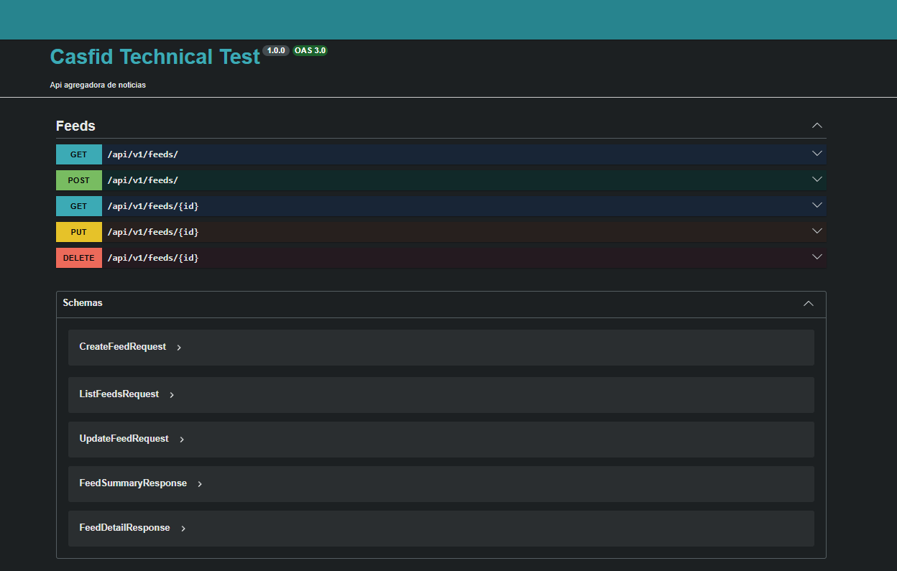
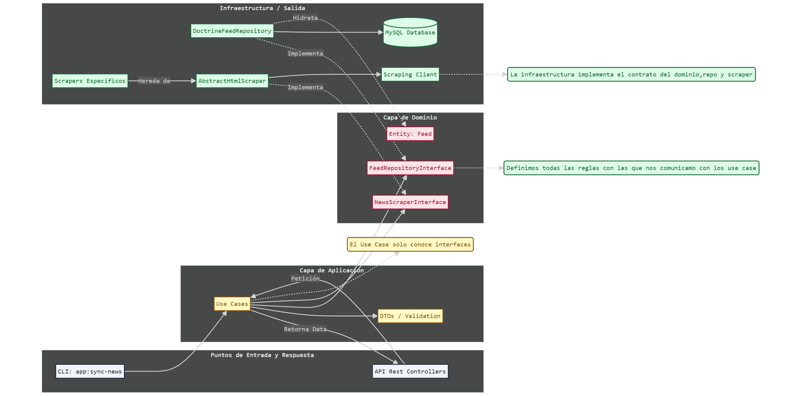

# Daily Trends API

Daily Trends es un agregador de noticias de portada desarrollado con **Symfony 7.2**. El sistema automatiza la extracción de contenidos de El País y El Mundo mediante web scraping y proporciona una interfaz RESTful para la gestión del ciclo de vida de las noticias.

## 1. Instrucciones de Despliegue y Uso

1.  **Levantar infraestructura**: `docker-compose up -d`.
2.  **Instalar dependencias**: `php composer install`.
3.  **Ejecutar migraciones**: `php bin/console doctrine:migrations:migrate --no-interaction`.
4.  **Sincronizar noticias (Scraping)**: `php bin/console app:sync-news`.
5.  **Actualizar Fixtures de Test**: Es recomendable ejecutar periódicamente `php bin/console app:fixtures:download` para actualizar los snapshots HTML locales. Esto permite ejecutar los tests sobre el diseño más actual de las webs externas, aumentando la fiabilidad sin depender de la red durante la ejecución de la suite.

6.  **Documentación Swagger**: Disponible en `/api/doc`.



## 2. Arquitectura y Diseño del Sistema

El proyecto se rige por los principios de la **Arquitectura Limpia (Hexagonal)**, asegurando que el núcleo de negocio sea independiente de los detalles de infraestructura.

* **Capa de Dominio**: Define las entidades (`Feed`), contratos de interfaces y excepciones de dominio. Se han utilizado Traits reutilizables para comportamientos transversales como `TimestampableTrait` y `SoftDeletableTrait`.
* **Capa de Aplicación**: Implementa los Casos de Uso que orquestan la lógica del sistema, como la sincronización de noticias (`SyncDailyNews`) y las operaciones CRUD. Utiliza DTOs para garantizar la integridad de los datos en la entrada y salida.
* **Capa de Infraestructura**: Gestiona la persistencia mediante **Doctrine ORM (MySQL)**, la lógica de scraping y los puntos de entrada de la API.

## 3. Motor de Scraping Polimórfico

La solución de scraping se ha diseñado para ser altamente escalable y resiliente:

* **Abstracción y Escalabilidad**: Se ha implementado una jerarquía basada en `AbstractHtmlScraper`. Este diseño permite añadir nuevos medios definiendo únicamente los selectores específicos, delegando la lógica de navegación y normalización de URLs a la clase base.
* **Resiliencia y Fallbacks**: Los scrapers utilizan un sistema de selectores múltiples por campo. Si el selector principal falla, el motor intenta extraer el dato con alternativas y registra un `WARNING` en los logs para alertar de posibles cambios de diseño.
* **Cliente Robusto**: El `ScrapingClient` implementa una política de reintentos con retardo progresivo (backoff) para manejar errores temporales de red.

## 4. API REST y Gestión de Datos

* **Control de Excepciones Unificado**: Se ha implementado un `ApiExceptionListener` que intercepta errores en el flujo `/api`. Este listener transforma excepciones técnicas o de dominio en respuestas JSON estandarizadas.
* **Paginación a medida**: He implementado una lógica de paginación propia integrada en el repositorio (`findAllPaginated`), apoyándome en el componente `Paginator` de Doctrine para el cálculo eficiente de offsets y conteo total.
* **Soft Delete**: Se ha integrado un sistema de borrado lógico mediante un contrato de interfaz y un filtro de Doctrine (`SoftDeleteFilter`).
* **UX en Actualizaciones**: El caso de uso `UpdateFeed` se comporta de forma flexible, actualizando únicamente los campos proporcionados para mejorar la integración.

## 5. Estrategia de Testing y Fixtures

* **Snapshot Testing**: Se ha desarrollado el comando `app:fixtures:download`. Este descarga y almacena localmente el HTML real de los diarios para ejecutar pruebas unitarias sobre datos verídicos sin peticiones HTTP reales.
* **Integración**: Se utilizan herramientas como **Zenstruck Foundry** para la creación ágil de datos de prueba y **DAMA\DoctrineTestBundle** para la gestión transaccional.

## 6. Arquitectura y Flujo de Datos




## 7. Extras & Bonus Track 

Para esta prueba técnica, he decidido agotar el tiempo de entrega e ir un paso más allá de los requisitos obligatorios, implementando dos funcionalidades que demuestran la flexibilidad de la arquitectura:


### Persistencia Intercambiable (Bonus: MongoDB)
Gracias al desacoplamiento de la arquitectura hexagonal, el sistema permite cambiar el motor de persistencia sin modificar la lógica de negocio ni los casos de uso.
* **Implementación de MongoDB**: Se ha desarrollado el adaptador `MongoFeedRepository` utilizando **Doctrine ODM**.
* **Conmutación en Caliente**: El sistema permite alternar entre **MySQL** y **MongoDB** simplemente modificando el alias de la interfaz en el archivo `config/services.yaml`.

*Nota: No me había dado tiempo de implementar la suite de tests automatizados sobre MongoDB, por lo que la suite de tests automatizados se mantiene configurada sobre MySQL, si bien la implementación de MongoDB es 100% funcional para el flujo de la aplicación y el Dashboard.*

```yaml
# Activar MySQL:
App\Domain\Repository\FeedRepositoryInterface: '@App\Infrastructure\Persistence\Doctrine\DoctrineFeedRepository'

# Activar MongoDB (Bonus):
# App\Domain\Repository\FeedRepositoryInterface: '@App\Infrastructure\Persistence\Mongo\MongoFeedRepository'
```


### Dashboard DEMO
He desarrollado una interfaz visual personalizada (Twig) para que la revisión de la prueba sea ágil, intuitiva y profesional.
* **Gestión Visual**: Un "News Feed" moderno con las imágenes reales obtenidas por el scraper, permitiendo monitorizar el estado de la base de datos de un vistazo.
* **Panel de Control**: Botones integrados para disparar el motor de scraping manualmente (**"Sincronizar"**) y realizar limpieza total de la base de datos (**"Limpiar Todo"**).
* **Acceso Directo**: Acceso inmediato a la documentación **Swagger** y al **Repositorio de código** desde la propia interfaz de usuario.

